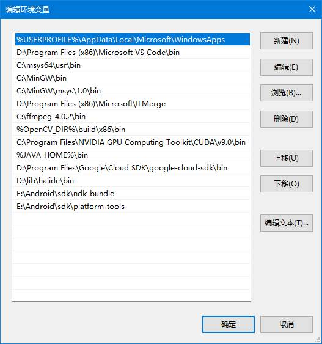
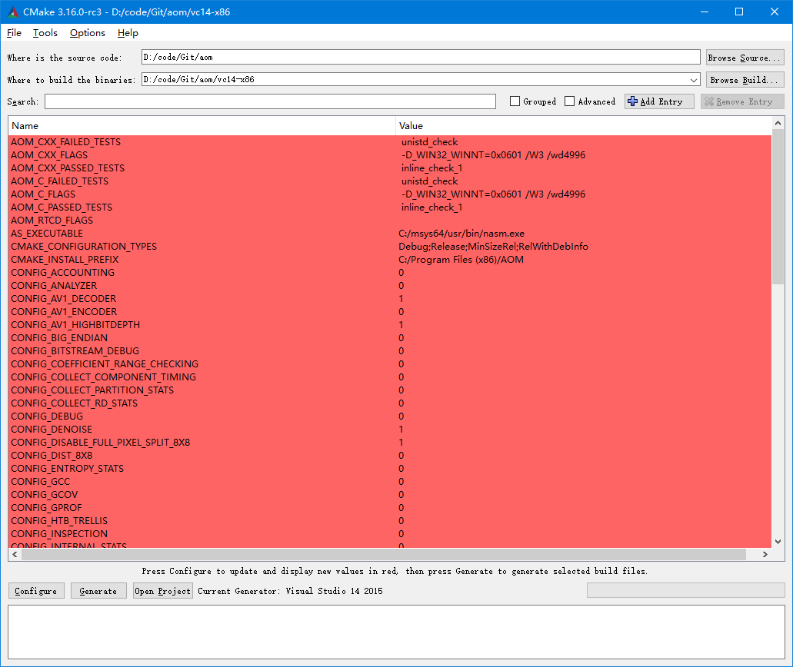

# 配置环境

### 1. 安装msys2：

​    http://www.msys2.org/

### 2. 设置代理：

打开`C:\msys64\etc\pacman.d`目录下的`mirrorlist.mingw32`，在开头添加：
`Server = https://mirrors.tuna.tsinghua.edu.cn/msys2/mingw/i686/`

在`mirrorlist.mingw64`开头添加：
`Server = https://mirrors.tuna.tsinghua.edu.cn/msys2/mingw/x86_64/`

在`mirrorlist.msys`开头添加：
`Server = https://mirrors.tuna.tsinghua.edu.cn/msys2/msys/$arch/`

### 3. 安装 make和asm：
```bash
pacman -S base-devel
pacman –S make gcc
pacman -S nasm
pacman -Sy #更新本地包数据
pacman -Su #升级其他包
#如果要安装meson，可以先用命令pacman -Ss meson查看可以使用的安装包，然后再选择：
pacman -S mingw32/mingw-w64-i686-meson
pacman -S mingw64/mingw-w64-x86_64-meson
```
 然后在环境变量Path中增加：`C:\msys64\mingw64\bin`

也可以直接将E盘备份的msys64.zip和MinGW.zip解压到C盘，然后配置环境变量：



# 编译

## 1.打开命令行窗口

​    在开始菜单中打开 *`visual studio 2015\vs2015 x86 Native Tools Command Prompt`*命令行

​    输入 **`C:\msys64\msys2_shell.cmd -mingw32 -use-full-path`**

​    如果是64位打开 *`visual studio 2015\vs2015 x64 Native Tools Command Prompt`*命令行

​    输入 **`C:\msys64\msys2_shell.cmd –mingw64 -use-full-path`**

<font color=blue>     **如果没有修改x264可以跳过下一步，直接执行第3步**</font>

## 2.<font color=green>编译x264</font><font color=red>（如果没有修改x264可以跳过这一步）</font>

​    cd到x264目录 <font color=#6030ff> `cd D:/code/FFmpeg4Win/x264`</font>

​     修改build.sh中内容：

```bash
#配置
CONFIG="./configure --enable-static --disable-opencl --prefix=$INSTALL"
$CONFIG
```
​      为：

```bash
#配置
CC=cl ./configure --enable-static --disable-opencl --prefix=$INSTALL
```

修改后的`build32.sh`为：

```bash
#配置安装Install目录
INSTALL=$PWD/output32

#进入目录进行编译安装
cd x264
chmod 777 configure config.sub config.guess version.sh
if test -s config.mak; then
    rm config.mak
fi

#配置
CC=cl ./configure  --enable-static --disable-opencl --prefix=$INSTALL

ret=$?
if [ $ret -ne 0 ]; then
    echo "config ret=$ret"
    exit $ret
fi

#编译并安装
make -j 8 && make install
ret=$?
if [ $ret -ne 0 ]; then
    echo "make ret=$ret"
    exit $ret
fi

if which tree; then
    tree $INSTALL
fi
cp -r $INSTALL/lib/libx264.lib $INSTALL/../../ffmpeg/external/win32/lib/libx264.lib
```
保存后执行：`./build32.sh`
编译成功后会生成静态库：`ouput32/lib/libx264.lib`，然后将lib文件拷贝到 `FFmpeg4Win\ffmpeg\external\win32\lib`

<font color=red>  **注意 `pkgconfig/x264.pc` 里的路径是否正确**</font>

## 3. 编译av1解码器
**3.1 编译libaom**

​    直接用cmake生成vs2015工程，可以关闭Encoder，关闭test可以减少工程数，生成的工程的代码生成里面要设置成/MT



**3.2 编译dav1d**

​    首先安装meson，可以下载 [meson.whl](https://download.lfd.uci.edu/pythonlibs/s2jqpv5t/meson-0.54.2-py3-none-any.whl)，然后用pip安装，安装成功后会在Python的安装路径下的scripts目录下生成一个meson.exe文件，如果配置了环境变量，可以直接使用这个exe文件，另外可能需要安装 [nasm](https://nasm.us/) (2.14 or higher)

​    都安装完成后，打开 *`visual studio 2017\x64 Native Tools Command Prompt for VS 2017`*

```bash
cd D:\code\Git\dav1d
meson setup vc15-x64 --backend vs2017 --default-library=static
```

​    编译32位版本与上面的过程类似


## 4. 编译FFmpeg

**添加外部库的支持**

如添加libdav1d的支持，打开`FFmpeg4Win/ffmpeg/ffmpeg/config.sh`，然后在中间添加`--enable-libdav1d --enable-decoder=libdav1d\`
然后打开`FFmpeg4Win/ffmpeg/build.sh`，然后在`export PKG_CONFIG_PATH`中添加`pkgconfig`路径：
`export PKG_CONFIG_PATH=$PWD/external/$PLATFORM/lib/pkgconfig:$PKG_CONFIG_PATH`
另外还要注意`dav1d.pc`里面的路径是否正确，修改的后的pc文件如下：

```bash
prefix=${pcfiledir}/../../..
libdir=${prefix}/win64/lib
includedir=${prefix}/include

Name: libdav1d
Description: AV1 decoding library
Version: 0.7.0
Libs: -L${libdir} -ldav1d
Cflags: -I${includedir}
```
修改后的`build64.sh`文件如下

```bash
#配置安装Install目录
INSTALL=$PWD/output64
PLATFORM=win64
export PKG_CONFIG_PATH=$PWD/external/$PLATFORM/lib/pkgconfig:$PKG_CONFIG_PATH
echo $PKG_CONFIG_PATH
rm -rf $INSTALL
mkdir $INSTALL

pkg-config  --libs --cflags x264
pkg-config  --libs --cflags aom
pkg-config  --libs --cflags dav1d

ff_config()
{
./configure --prefix=../output64 \
 --toolchain=msvc \
 --arch=x86_64 \
 --enable-gpl --enable-nonfree --enable-version3 --enable-small \
 --disable-network      \
 --enable-avcodec \
 --enable-avformat \
 --enable-avutil \
 --enable-swresample \
 --enable-swscale \
 --enable-avfilter \
 --enable-muxers \
 --enable-demuxers \
 --disable-encoders --enable-encoder=aac --enable-encoder=rawvideo \
 --enable-libx264 --enable-encoder=libx264 \
 --enable-libaom --enable-decoder=libaom_av1 \
 --enable-libdav1d --enable-decoder=libdav1d \
 --disable-protocols --enable-protocol=file \
 --disable-bsfs --enable-bsf=h264_mp4toannexb \
 --disable-indevs \
 --disable-doc \
 --disable-outdevs --enable-ffprobe --enable-ffmpeg --enable-ffplay --disable-debug \
 --disable-shared \
 --enable-static
}

#进入目录进行编译安装
cd ffmpeg

ff_config && make -j 6 && make install
ret=$?
if [ $ret -ne 0 ]; then
    echo "make ret=$ret"
    exit 1
fi

if which tree; then
    tree $INSTALL
fi
```

`build32.sh`文件如下

```bash
#配置安装Install目录
INSTALL=$PWD/output32
PLATFORM=win32
export PKG_CONFIG_PATH=$PWD/external/$PLATFORM/lib/pkgconfig:$PKG_CONFIG_PATH
echo $PKG_CONFIG_PATH
rm -rf $INSTALL
mkdir $INSTALL

pkg-config  --libs --cflags x264
pkg-config  --libs --cflags dav1d
pkg-config  --libs --cflags aom

ff_config()
{
./configure --prefix=../output32 \
 --toolchain=msvc \
 --arch=x86 \
 --enable-gpl --enable-nonfree --enable-version3 --enable-small \
 --disable-network      \
 --enable-avcodec \
 --enable-avformat \
 --enable-avutil \
 --enable-swresample \
 --enable-swscale \
 --enable-avfilter \
 --enable-muxers \
 --enable-demuxers \
 --disable-encoders --enable-encoder=aac --enable-encoder=rawvideo \
 --enable-libx264 --enable-encoder=libx264 \
 --enable-libaom --enable-decoder=libaom_av1 \
 --enable-libdav1d --enable-decoder=libdav1d \
 --disable-protocols --enable-protocol=file \
 --disable-bsfs --enable-bsf=h264_mp4toannexb \
 --disable-indevs \
 --disable-doc \
 --disable-outdevs --enable-ffprobe --enable-ffmpeg --enable-ffplay --disable-debug \
 --disable-shared \
 --enable-static
}

#进入目录进行编译安装
cd ffmpeg

ff_config && make -j 6 && make install
ret=$?
if [ $ret -ne 0 ]; then
    echo "make ret=$ret"
    exit 1
fi

if which tree; then
    tree $INSTALL
fi
```

`clean.sh` 文件内容如下：

```bash
cd ffmpeg
make distclean
rm -f test.obj
```

**编译ffmpeg**

   cd到FFmpeg目录 <font color=#6030ff> `cd D:/code/FFmpeg4Win/ffmpeg`</font>

* 如果编译32位库，先执行`./clean.sh` 清空原始缓存，然后执行`./build32.sh`

+ 如果编译64位库，先执行`./clean.sh`，然后执行`./build64.sh`

**把output目录下面生成的lib文件拷贝到 [ffmpegDll](https://github.com/chinue/FFmpegDll) 工程中，然后编译生成`ffmpeg.dll`**